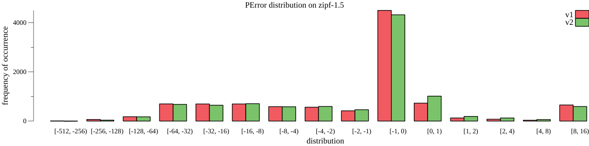
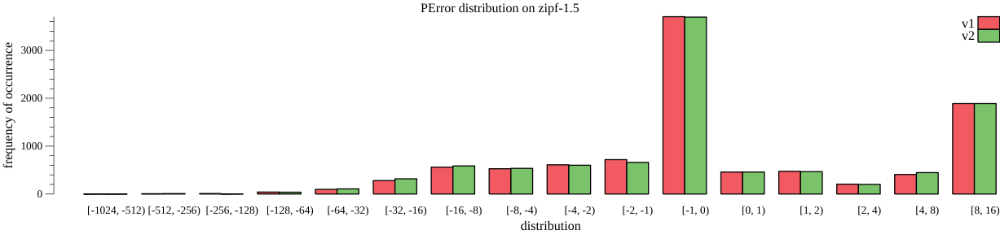

# mul-cols-range-query-on-index
## zipf-1.5

OverEstimation Statistics

| Instance | Total | P50 | P90 | P99 | Max |
| ---- | ---- | ---- | ---- | ---- | ---- |
| v1 | 1616 | 1.445 | 9.000 | 9.000 | 9.000 |
| v2 | 1976 | 0.933 | 9.000 | 9.000 | 10.900 |

UnderEstimation Statistics

| Instance | Total | P50 | P90 | P99 | Max |
| ---- | ---- | ---- | ---- | ---- | ---- |
| v1 | 8400 | -1.000 | -36.000 | -113.000 | -293.000 |
| v2 | 8197 | -1.000 | -35.111 | -89.000 | -348.000 |

# mul-cols-point-query-on-index
## zipf-1.5

OverEstimation Statistics

| Instance | Total | P50 | P90 | P99 | Max |
| ---- | ---- | ---- | ---- | ---- | ---- |
| v1 | 3411 | 9.000 | 9.000 | 9.000 | 9.000 |
| v2 | 3435 | 9.000 | 9.000 | 9.000 | 9.000 |

UnderEstimation Statistics

| Instance | Total | P50 | P90 | P99 | Max |
| ---- | ---- | ---- | ---- | ---- | ---- |
| v1 | 6556 | -1.000 | -11.500 | -59.000 | -699.000 |
| v2 | 6554 | -1.000 | -13.286 | -54.556 | -699.000 |

